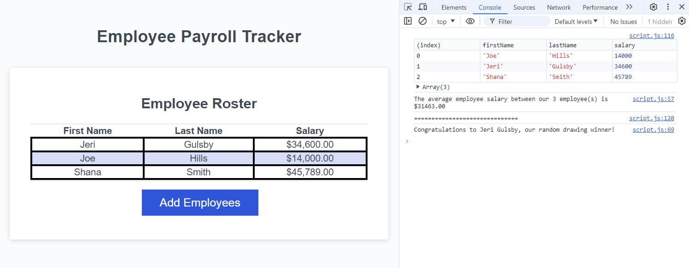

# Employee Payroll Tracker

## Description

An employee payroll tracker made with JavaScript that receives input for employee salary information, prints the average salary of all employees, and randomly selects one employee. The results are printed to the Developer Console.

## Screenshot

Below is a screenshot of the employee payroll tracker showing sample information and output to the developer console.

## Deployment

This application is deployed to GitHub Pages at [https://kim-lan.github.io/bootcamp-module-03-employee-payroll-tracker/](https://kim-lan.github.io/bootcamp-module-03-employee-payroll-tracker/)
